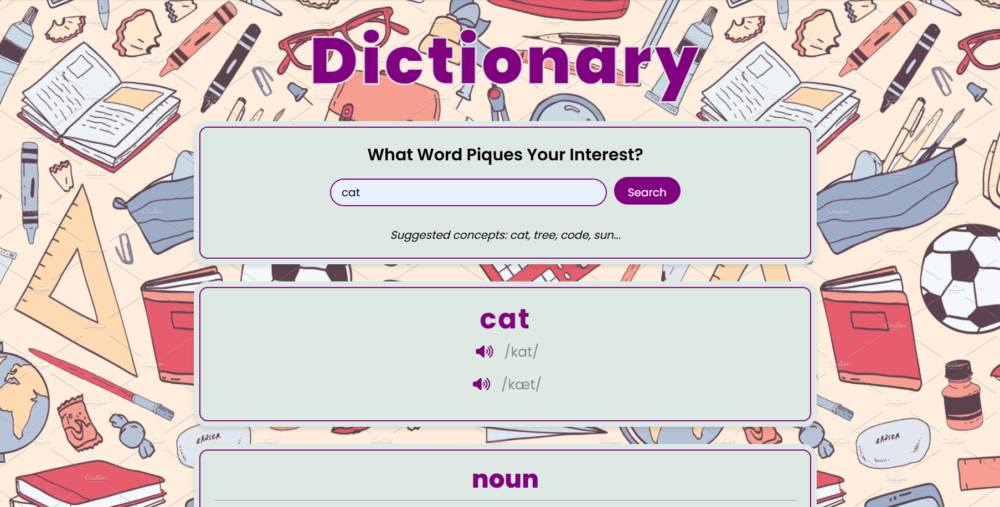

# Dictionary App

The Dictionary App is a web application developed using React.js. It enables users to search for word definitions, synonyms, antonyms, and example sentences. The app offers a user-friendly interface for vocabulary exploration and enrichment, allowing users to enhance their language skills effectively.

## Table of Contents
- [Features](#features)
- [Technologies & Tools Used](#technologies--tools-used)

## Features
- Search for word definitions, pronunciation, examples, synonyms, antonyms, and images.
- Pronunciation feature allows users to listen to the correct pronunciation of words.
- Provides comprehensive word information, including the word's part of speech (noun, verb, adjective, etc.).
- Offers example sentences to understand the word's usage in context.
- Displays synonyms and antonyms to expand vocabulary and improve language skills.
- Includes images related to the searched word for visual representation and better understanding.
- User-friendly interface for easy navigation and efficient search.

## Technologies & Tools Used
- ReactJs
- JavaScript
- CSS
- VS Code

https://dictionaryapi.dev/